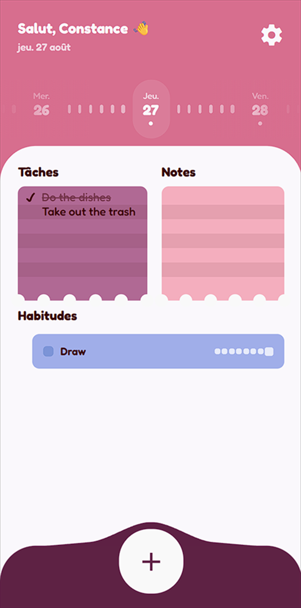
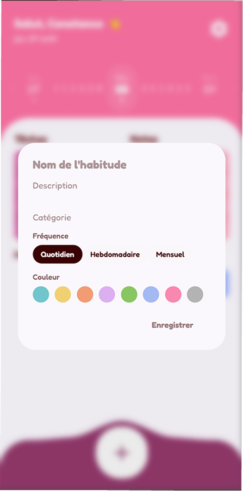

# Watodo

**Watodo** is a task and habit tracker app for Android and iOS made with **Expo** and **Firebase**. It comes with a funny and playful UI. *(The app is currently only in French)*

## Showcase

<div center=true>
   
   
   
</div>

## Todo list

- [ ] User login
- [ ] Complete the habit features
- [ ] Localization
- [ ] Themes

If you want to work on this project, don't hesitate.

## Get started

1. Install dependencies

   ```bash
   npm install
   ```

2. Start the app

   ```bash
   npx expo start
   ```

## License

This project is licensed under the terms of the [MIT license](./LICENSE).
